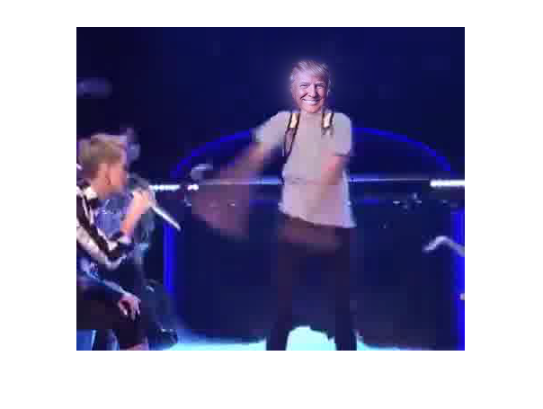

# Blend moving images #
Last practical exercise for *Digital Video Processing*, optional subject of the last telecommunications engineering year at University of Granada. Most of the ideas and several fragments of the scripts are made by teacher [Javier Mateos Delgado](http://decsai.ugr.es/~jmd/).

Usage
-----
The script is nothing but an example. We have a video of a kid dancing and we want to replace his face in every frame by Trump's face. We use Gaussian and Laplacian pyramids for the mixing. In order to get the position of the face in every frame we need we capture the block with the smaller information differece.

